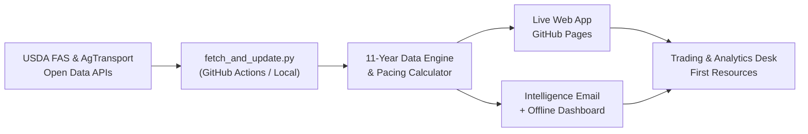
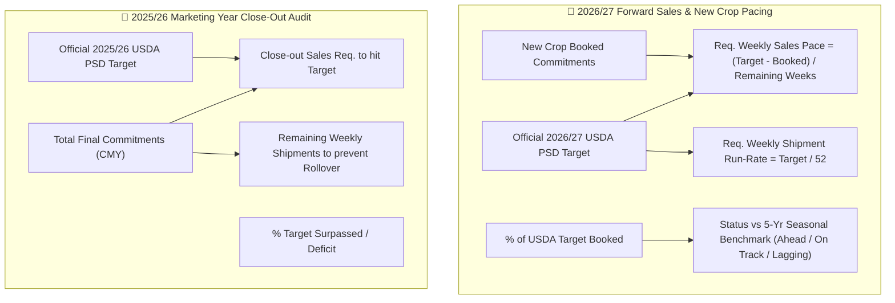
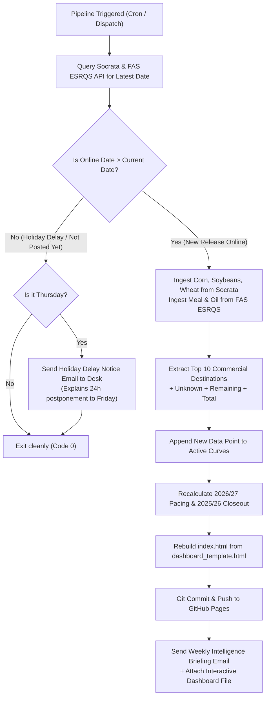

# USDA Export Sales Seasonal Progress & Pacing Tracker
## Comprehensive Project Summary & Handover Documentation

**Client / Stakeholder:** First Resources Limited &bull; Ag Research & Trading Desk  
**Recipient:** `chengguan.hui@first-resources.com`  
**Live Production URL:** [https://huichengguan.github.io/usda-export-sales/](https://huichengguan.github.io/usda-export-sales/)  
**GitHub Repository:** `https://github.com/huichengguan/usda-export-sales`  
**Latest Release in System:** Week Ending August 27, 2026 (Week 52 Closeout)  

---

## 1. Executive Summary

This project delivers an automated, end-to-end intelligence and analytics platform for US Agricultural Export Sales. It tracks 11 historical marketing years (2016/17 through 2026/27) across 5 key agricultural commodities:
1. **Corn**
2. **Soybeans**
3. **Wheat**
4. **Soybean Meal**
5. **Soybean Oil**

The system operates autonomously in the cloud: every week when USDA publishes its Export Sales report (Thursdays at 8:30 AM US Eastern, or Fridays on federal holiday weeks), it ingests the latest figures, recalculates weekly seasonal run-rates against official USDA PSD balance sheet targets, updates the live interactive GitHub Pages dashboard, and delivers an intelligence briefing email with complete Top 10 destination tables and an attached standalone offline dashboard.



---

## 2. Core Modules & Capabilities

### 2.1 Interactive Canvas Dashboard (`index.html`)
* **Live Web Access:** Hosted permanently on GitHub Pages for instant viewing across PCs, tablets, and mobile devices without installation.
* **Dual Unit Support:** Instant toggle between **`1,000 MT`** (industry standard) and **`mn t`** (macro balance sheet standard) with real-time numeric and scale re-rendering.
* **Category Switching:** Toggle between:
  * `tot`: **Total Commitments** (Accumulated Exports + Outstanding Sales)
  * `acc`: **Accumulated Exports** (Actual shipped volume)
  * `out`: **Outstanding Sales** (Unshipped forward sales)
* **Custom Dynamic Destination Filtering:**
  * **Quick Presets:** `🌎 All Destinations (Total US)`, `⭐ Top 10 Ranked`, `⭐ Top 5 Ranked`.
  * **Independent Multi-Select Checklist:** Check or uncheck any combination of commercial buyers (e.g. Mexico, Japan, Colombia, China) to dynamically sum and chart their combined historical curves.
  * **Table-to-Chart Sync:** Clicking any destination row in the release table instantly isolates that country in the chart.
* **Nice Y-Axis Scaling:** Clean "nice numbers" algorithm (`1, 2, 5, 10 × 10ⁿ`) with a solid zero baseline, subtle gridlines, 78px left padding, and strict volume bounding.
* **True Calendar-Month X-Axis Progression:**
  * Uniform spacing (61–76px) across 17 calendar milestones (Weeks 0, 4, 9, 13, 17, 22, 26, 31, 35, 39, 44, 48, 52, 56, 61, 65, 70).
  * 3-letter month labels with blue highlighted kickoff (`Sep`) and red highlighted closeout (`Aug`).
  * Two-tier phase bracket separating the `🌱 Forward Sales Window (22 Wks)` from the `🚢 Official Marketing Year (52 Wks)`.
* **Destination-Restricted WASDE Target Trajectory:**
  * The USDA official annual export target trajectory (dashed amber line) and target guideline are strictly displayed **only when All Destinations (Total US) is selected**. When focusing on individual countries or subgroups, the line and banner hide automatically to avoid distorting local axes.

---

### 2.2 USDA Export Target Pacing & Weekly Seasonal Run-Rate Analysis
The system incorporates an automated pacing audit matrix covering both marketing year phases:



#### Official USDA FAS PSD Balance Sheet Export Targets in the System:
| Commodity | 2026/27 New Crop Target | 2025/26 Closeout Target | Current Pace Status (as of Aug 27) |
| :--- | :---: | :---: | :--- |
| 🌽 **Corn** | **83.189 mn t** *(83,189 k MT)* | **86.364 mn t** *(86,364 k MT)* | **Ahead** (17.4% booked vs 16.5% 5-yr avg; 2025/26 surpassed target at 100.7%) |
| 🌿 **Soybeans** | **49.668 mn t** *(49,668 k MT)* | **41.368 mn t** *(41,368 k MT)* | **Lagging** (14.2% booked vs 21.8% 5-yr avg; req. 819.3 k MT/wk sales) |
| 🌾 **Wheat** | **23.814 mn t** *(23,814 k MT)* | **22.997 mn t** *(22,997 k MT)* | **On Track** (41.5% booked vs 42.1% 5-yr avg; req. 357.2 k MT/wk sales) |
| 📦 **Soybean Meal** | **17.690 mn t** *(17,690 k MT)* | **18.002 mn t** *(18,002 k MT)* | **Ahead** (17.7% booked vs 15.2% 5-yr avg; 2025/26 met target at 100.0%) |
| 🫗 **Soybean Oil** | **0.907 mn t** *(907 k MT)* | **0.376 mn t** *(376 k MT)* | **On Track** (1.0% forward booked; 2025/26 surpassed target at 376 k MT) |

---

### 2.3 Top 10 Commercial Buyers & Release Breakdown Table
For every release, the dashboard and email display a complete 13-row commercial breakdown:
1. **Rows 1 to 10:** The top 10 ranked commercial destination countries sorted by total commitments.
2. **Row 11:** *Unknown Destinations* (unassigned export licenses and trading house bookings).
3. **Row 12:** *Remaining Destinations* (aggregate of all other destinations worldwide).
4. **Row 13:** *TOTAL ALL DESTINATIONS* (full official US balance sheet total).

**Columns Tracked:**
* **Accum Exp:** Accumulated exports shipped to date in the current marketing year.
* **Outstanding (CMY):** Booked unshipped sales for current marketing year delivery.
* **Total Commit (CMY):** Sum of shipped exports and unshipped sales (`Accum Exp + Outstanding`).
* **Weekly Net (CMY):** Net new sales booked during the release week for current crop.
* **Weekly Net (NMY):** Net new forward sales booked during the release week for next crop.
* **New Crop Outstanding:** Forward sales booked for delivery in the next marketing year.

---

## 3. Automation Pipeline & Holiday Schedule

### 3.1 Release Calendar & Automatic Holiday Fallback
* **Standard Releases:** Every Thursday at **8:30 AM US Eastern Time**.
* **US Federal Holiday Postponements:** Whenever a federal holiday falls on a Monday or Friday (e.g. Labor Day Monday, Memorial Day Monday), USDA FAS postpones the report by 24 hours to **Friday at 8:30 AM US Eastern Time**.
* **Timezone Mapping:**
  * **Summer / Fall (EDT, UTC-4):** 8:30 AM EDT = **12:30 UTC / 20:30 SGT (8:30 PM Singapore)**.
  * **Winter (EST, UTC-5):** 8:30 AM EST = **13:30 UTC / 21:30 SGT (9:30 PM Singapore)**.

### 3.2 GitHub Actions Cloud Workflow (`weekly_export_sales.yml`)
The workflow runs automatically with zero local computer dependency:
```yaml
name: USDA Weekly Export Sales Intelligence

on:
  schedule:
    # Summer/Fall EDT (April - November): 8:30 AM EDT = 12:30 UTC / 20:30 SGT (plus 30m delay retry)
    - cron: '30 12 * * 4'
    - cron: '00 13 * * 4'
    # Winter EST (November - March): 8:30 AM EST = 13:30 UTC / 21:30 SGT (plus 45m delay retry)
    - cron: '30 13 * * 4'
    - cron: '15 14 * * 4'
    # Friday Backup Schedule for US Federal Holiday Delays (e.g. Labor Day, Memorial Day)
    - cron: '30 12 * * 5'
    - cron: '00 13 * * 5'
    - cron: '30 13 * * 5'
    - cron: '15 14 * * 5'
  workflow_dispatch: # Allows manual run anytime with a single click
```

### 3.3 Pipeline Logic (`fetch_and_update.py`)


---

## 4. Key Repository Files & Structure

```
usda_export_sales/
├── .github/
│   └── workflows/
│       └── weekly_export_sales.yml   # Multi-tier cron schedule for Thursday & Friday releases
├── dashboard_template.html            # Clean dashboard template with CSS, Canvas engine & placeholders
├── multi_commodity_payload.json       # Enriched 11-year dataset for all 5 commodities (~9.8 MB)
├── index.html                         # Live production web dashboard deployed to GitHub Pages (10.3 MB)
├── fetch_and_update.py                # Automated cloud pipeline engine (API fetch, pacing, HTML, email)
├── SUMMARY.md                         # This master documentation and project summary
└── README.md                          # Quickstart guide and repository documentation
```

### File Details:
1. **[`fetch_and_update.py`](file:///C:/Users/guang/.gemini/antigravity/scratch/usda_export_sales/fetch_and_update.py)**:
   * Direct integration with USDA Socrata SODA API (`agtransport.usda.gov/resource/wnn7-29tu.json`) and USDA FAS ESRQS API (`apps.fas.usda.gov/esrqs`).
   * Dynamic destination aggregation, Top 10 ranking, and remaining balance calculations.
   * USDA Pacing run-rate and requirement algorithms.
   * Robust SMTP delivery with 120s timeouts and 3 automatic connection retries.
2. **[`dashboard_template.html`](file:///C:/Users/guang/.gemini/antigravity/scratch/usda_export_sales/dashboard_template.html)**:
   * Pure HTML5 canvas vector rendering engine with crisp retina scaling.
   * `{{RELEASE_DATE}}` and `{{COMMODITIES_PAYLOAD}}` template placeholders.
   * Dynamic responsive design utilizing Tailwind CSS.
3. **[`multi_commodity_payload.json`](file:///C:/Users/guang/.gemini/antigravity/scratch/usda_export_sales/multi_commodity_payload.json)**:
   * Structured JSON containing 11 marketing years of aligned data points, category breakdowns, and USDA balance sheet export pacing data.

---

## 5. Instructions for Moving Chat into a Project

When moving this chat into a persistent project:
1. **Active Working Directory:** Set the project workspace root to:
   ```
   C:\Users\guang\.gemini\antigravity\scratch\usda_export_sales
   ```
2. **GitHub Remote Connection:** The repository is already initialized, linked, and synchronized with `origin/main` at:
   ```
   https://github.com/huichengguan/usda-export-sales.git
   ```
3. **Environment & Secrets:**
   * Local SMTP credentials are stored in `C:\Users\guang\.gemini\antigravity\scratch\farmdoc_agent\.env`.
   * GitHub Repository Secrets are configured with `SMTP_USER`, `SMTP_PASSWORD`, and `EMAIL_RECIPIENT`.
4. **Manual Runs / Testing:**
   * To check status: `python fetch_and_update.py`
   * To force an immediate dashboard rebuild and email delivery: `python fetch_and_update.py --force`
   * To trigger in cloud: Visit GitHub > Actions > **USDA Weekly Export Sales Intelligence** > **Run workflow**.

---
*Documentation compiled and verified on September 11, 2026. All components tested and verified operational.*
